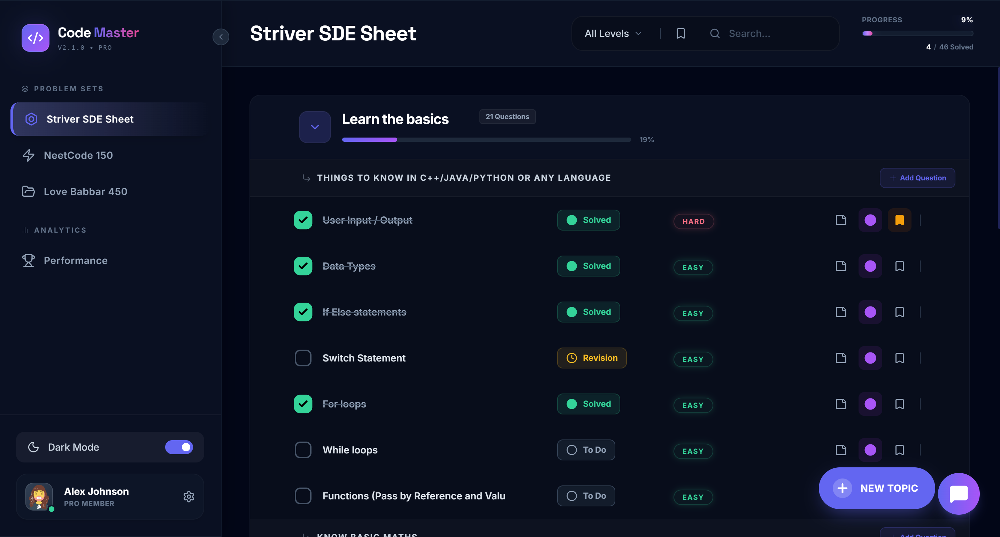

# 🚀 CodeMaster - Interactive Question Management Sheet

<div align="center">

[](YOUR_DEPLOYMENT_LINK_HERE)
[](https://reactjs.org/)
[](https://www.typescriptlang.org/)

**An interactive DSA problem tracker with AI assistance, drag-and-drop reordering, and real-time progress tracking**

[🌐 Live Demo](https://codemaster-interactive-question-tra.vercel.app) • [📖 Features](#-features) • [🚀 Quick Start](#-quick-start)

</div>

---

## 📋 Overview

CodeMaster is a single-page web application for managing hierarchical DSA questions organized by topics and sub-topics. Built with React, TypeScript, and Tailwind CSS, it provides an intuitive interface for tracking coding interview preparation.

---

## Development Notes

This project was built as part of an assignment.
AI tools were used during initial scaffolding and exploration, followed by manual refinement, debugging, and feature completion by me.

---

## ✨ Features

### Core Functionality (Assignment Requirements)
- ✅ **Create/Edit/Delete Topics** - Full CRUD operations for topic categories
- ✅ **Create/Edit/Delete Sub-topics** - Complete management of sub-categories
- ✅ **Create/Edit/Delete Questions** - Manage problems with title, URL, difficulty, and descriptions
- ✅ **Drag & Drop Reordering** - Rearrange topics, sub-topics, and questions
- ✅ **State Management** - Zustand with LocalStorage persistence
- ✅ **Responsive Design** - Mobile-friendly with Tailwind CSS

### Bonus Features
- 🤖 **AI Chatbot** - Integrated Gemini AI for problem hints and explanations
- 🎨 **Dark/Light Mode** - Theme switching with persistent preferences
- 🎉 **Confetti Celebrations** - Visual feedback when completing topics
- 📊 **Progress Tracking** - Animated progress bars and analytics dashboard
- 📝 **Notes System** - Take notes on individual questions
- 🔖 **Bookmarking** - Mark important problems for quick access
- 🔍 **Advanced Filtering** - Filter by difficulty level and bookmarks
- ✅ **Status Workflow** - Track progress: Todo → Solved → Revision

---

## 🛠️ Tech Stack

- **Frontend**: React 19.2.4, TypeScript 5.8.2
- **Build Tool**: Vite 6.2.0
- **Styling**: Tailwind CSS (CDN), Custom Glassmorphism UI
- **State Management**: Zustand 5.0.11 with persist middleware
- **AI Integration**: Google GenAI SDK 1.40.0 (Gemini 2.5 Flash Lite)
- **UI Libraries**: 
  - Lucide React (icons)
  - @dnd-kit (drag & drop)
  - canvas-confetti (celebrations)

---

## 🚀 Quick Start

### Prerequisites
- Node.js (v18+)
- npm or yarn
- Google Gemini API Key ([Get one here](https://makersuite.google.com/app/apikey))

### Installation

```bash
# Clone the repository
git clone https://github.com/KiritoReborn/Codemaster-interactive_question_tracker.git
cd codemaster

# Install dependencies
npm install

# Create .env.local file
echo "VITE_API_KEY=your_gemini_api_key_here" > .env.local

# Run development server
npm run dev

# Open http://localhost:3000
```

### Build for Production

```bash
npm run build
npm run preview
```

---

## 🎯 Usage

1. **Manage Topics** - Create, edit, delete, and reorder topic categories via drag & drop
2. **Manage Sub-topics** - Add, edit, delete, and reorder sub-categories within topics
3. **Manage Questions** - Full CRUD operations with drag & drop reordering
4. **Track Progress** - Click status buttons to cycle: Todo → Solved → Revision
5. **Use AI Assistant** - Click the chat button for hints and explanations
6. **Take Notes** - Click the note icon to add personal notes
7. **Filter & Search** - Use difficulty filters and bookmarks to focus your study
8. **Switch Themes** - Toggle between dark and light mode

---

## 📸 Screenshots

### Main Dashboard


### AI Chatbot


---

## 🎨 UI Highlights

- **Glassmorphism Design** - Frosted glass effects with backdrop blur
- **Smooth Animations** - Progress bars, hover effects, and transitions
- **Ambient Lighting** - Dynamic gradient backgrounds
- **Responsive Layout** - Optimized for desktop, tablet, and mobile
- **Collapsible Sidebar** - Maximize workspace on desktop

---

## 📝 Assignment Compliance

This project fulfills **ALL** requirements from the Interactive Question Management Sheet assignment:

| Requirement | Status |
|------------|--------|
| **Create Topics** | ✅ Implemented |
| **Edit Topics** | ✅ Implemented |
| **Delete Topics** | ✅ Implemented |
| **Create Sub-topics** | ✅ Implemented |
| **Edit Sub-topics** | ✅ Implemented |
| **Delete Sub-topics** | ✅ Implemented |
| **Create Questions** | ✅ Implemented |
| **Edit Questions** | ✅ Implemented |
| **Delete Questions** | ✅ Implemented |
| **Drag & Drop Topics** | ✅ Implemented |
| **Drag & Drop Sub-topics** | ✅ Implemented |
| **Drag & Drop Questions** | ✅ Implemented |
| **React Framework** | ✅ React 19.2.4 |
| **Tailwind CSS** | ✅ Implemented |
| **Zustand State Management** | ✅ Implemented |
| **Sample Data Integration** | ✅ Striver SDE Sheet |
| **Clean & Intuitive UI** | ✅ Glassmorphism Design |
| **Bonus Improvements** | ✅ 10+ Additional Features |

### ✨ 100% Requirement Coverage + Extensive Bonus Features

---

## 🐛 Known Issues

- API integration uses local state (no backend calls to provided endpoint)
- Chart visualization in analytics dashboard is a placeholder

---

## 📄 License

This project is licensed under the MIT License.

---

## 📧 Contact

**Developer**: Raghu 
**Email**: raghu.p0808@example.com  
**GitHub**: [@KiritoReborn](https://github.com/KiritoReborn)  
**LinkedIn**: [Your Profile](https://linkedin.com/in/jaya-raghunandhan-reddy-p-2006aug)

---

<div align="center">

**Made with ❤️ for the Internship Assignment**

</div>
